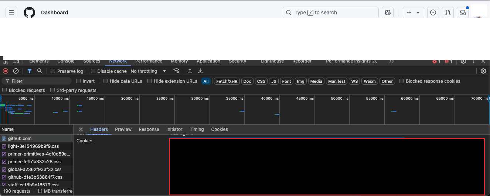

# Export GitHub Issues

# Preparation
Install dependancies
    
```bash
pip install -r requirements.txt
```

## Option: Virtual Environment

Create a virtual environment

```bash
python -m venv .venv
source .venv/bin/activate
```

Install dependancies

```bash
pip install -r requirements.txt
```

Deactivate the virtual environment

```bash
deactivate
```

# Usage
1. Set target environments

```bash
export GITHUB_API_ENDPOINT="https://api.github.com"
export GITHUB_ORG="your-org"
export GITHUB_REPO="your-repo"
export GITHUB_TOKEN="your-token"
export GITHUB_OUTPUT="/path/to/output"
```

or

Create a `.env` file with the following content:

```plaintext
GITHUB_API_ENDPOINT=https://api.github.com
GITHUB_ORG=your-org
GITHUB_REPO=your-repo
GITHUB_TOKEN=your-token
GITHUB_OUTPUT=/path/to/output
```

2. Run the script

```bash
python export.py
```

# Output
md files will be generated in the `GITHUB_OUTPUT` directory.

# Options
## Download attachments

> [!WARNING]  
> This is a very dangerous operation. Please make sure you understand the content before proceeding.

If you want to download attachments, do following tasks.

1. create `.cookie` file in the root directory
2. open your browser with developer tools.
3. access to https://github.com with login.
4. copy the value of `cookie` from the `network` tab.

5. paste the value to the `.cookie` file.
6. run the script with `--download-images` option.

```bash
python export.py --download-images
```
